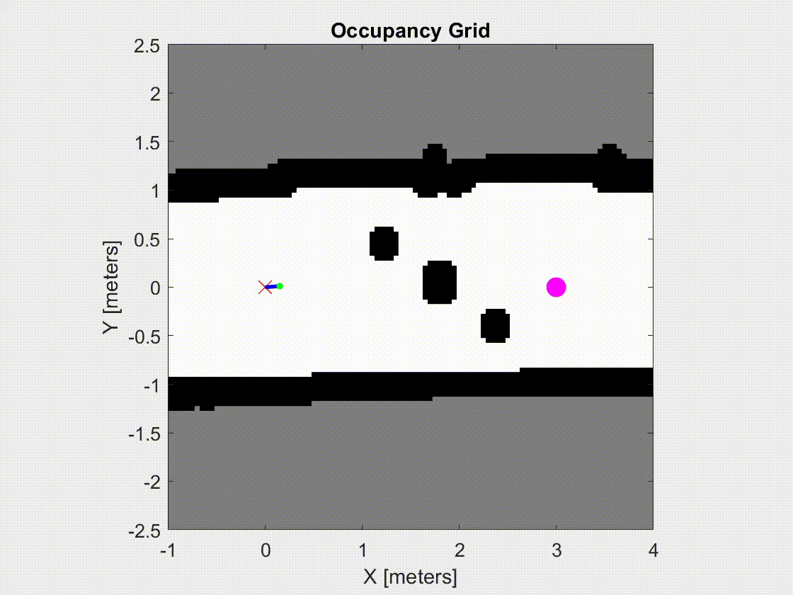

# Lab 4 - RRT

## Instructions

1. Follow the instructions from [`rc-matlab-lib`](https://github.com/MobileRoboticsLab/rc-matlab-lib) to run a RC car from MATLAB using your keyboard.

2. Use the `StartRCKeyboardWMap` command/script to drive the robot around an obstacle course (set up in hallway) and see the map. Make sure not to move around the robot, as it will mess up the internal localization and the map.

3. When your map is complete in the obstacle region, use `RC.saveMap()` to save the map data to a file. Copy the file to the same directory as your `main.m` file.

4. Implement RRT on your saved map to get from a starting point (0,0) to a goal point on the other side of the obstacles.

5. Plot the RRT search branches on the map figure and save the final result as an image. 

## Important Functions

- `load('OccupancyGridSave.mat')`: Load the saved map into your workspace
- `show(saved_map)`: Show the saved map in a figure. You can use `axis(xmin xmax ymin ymax)` to zoom in to a specific region.
- `val = checkOccupancy(saved_map, [check_x check_y]);`: Check the occupancy of a specific location on the map. Returns 0 for free, 1 for occupied, and -1 for unknown space.
- `inflate(saved_map, inflate_size)`: Inflate the obstacles on your map by some size. Necessary to prevent the robot from clipping the edges of the obstacles.

## Example Result

